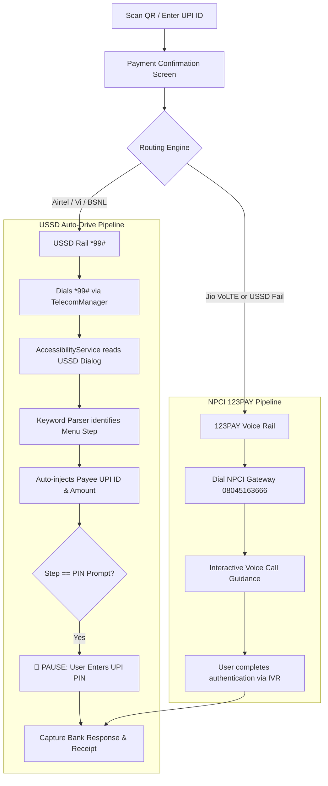

# ⚡ OFFLINE-PAY (OfflinePay Android)

<div align="center">

[](https://developer.android.com)
[](https://kotlinlang.org)
[](https://developer.android.com/jetpack/compose)
[](https://developer.android.com/topic/architecture)
[](https://www.zetetic.net/sqlcipher/)
[](LICENSE)

### **Zero-Internet UPI Payments via Automated USSD (`*99#`) & NPCI 123PAY IVR**

*Turn tedious 10-step telecom USSD menus into a sleek, instant 1-tap payment experience with hardware-backed encryption, carrier-adaptive routing, and an Apple-grade frosted glass UI.*

---

[Key Features](#-key-features) • [Architecture](#-modular-architecture) • [Payment Rails](#-multi-rail-payment-engine) • [Security](#-bank-grade-security) • [Design System](#-apple-grade-glassmorphism-ui) • [Build Guide](#-build--installation)

</div>

---

## 📌 Problem & Motivation

Digital payments (UPI) in India process billions of transactions monthly, but they fail instantly when:
- Cellular data or Wi-Fi connectivity is lost (underground metros, remote highways, rural villages, basements).
- Network congestion chokes cellular internet during crowded events, festivals, or disasters.
- Users run out of active mobile data packs.

While NPCI supports telecom-level offline rails like **`*99#` USSD** and **123PAY IVR (`08045163666`)**, traditional USSD requires manually dialing codes and navigating **10+ sequential text prompts** (Select Language → Send Money → UPI ID → Payee Name → Amount → Remark → PIN). This is slow, error-prone, and painful at physical checkout counters.

**OFFLINE-PAY solves this completely:** It captures the merchant QR code or UPI ID, automatically calculates the optimal telecom rail, and auto-drives the USSD menu pipeline in the background using an `AccessibilityService` orchestration engine, stopping only at the secure UPI PIN prompt for the user.

---

## ✨ Key Features

- ⚡ **1-Tap Offline Payments:** Scan any standard UPI QR or enter a UPI ID / phone number and pay without cellular data or Wi-Fi.
- 🤖 **USSD Auto-Drive Engine (`*99#`):** Automatically types each step (Send Money → Payee → Amount) via forward-cursor keyword parsing and state-machine debouncing.
- 🛡️ **Zero-Compromise Security:** UPI PIN is **never stored, captured, or automated**—the auto-driver strictly yields control at the authentic OS/SIM PIN prompt.
- 📞 **NPCI 123PAY Voice IVR Rail:** Seamless automated fallback to national IVR payment routing (`08045163666`) with dual-SIM telephony awareness.
- 📶 **Carrier-Adaptive Routing Engine:** Dynamic capability detection (e.g., auto-routes Jio 4G/VoLTE to 123PAY IVR while routing Airtel/Vi/BSNL to `*99#` USSD).
- 📷 **High-Performance QR Scanner:** CameraX + Google ML Kit Barcode Scanning with ZXing fallback and strict NPCI parameter validation.
- 💎 **Apple-Grade Glassmorphic UI:** Custom Jetpack Compose design system with frosted translucent surfaces, ambient radial aurora backdrops, and iOS tactile spring interactions.
- 🔒 **Encrypted Local Storage:** SQLCipher 256-bit AES database backed by Android Keystore unwrap for secure transaction history, receipts, and merchant ledger.
- 📄 **Offline Cryptographic Receipts:** Generates verifiable local payment receipts with FileProvider CSV export.

---

## 🏛️ Modular Architecture

OFFLINE-PAY is structured as a **Multi-Module Clean Architecture** project adhering to modern Android development best practices:

```
OFFLINE-PAY/
├── app/                          # Main Application entry point, DI assembly, Navigation host
│
├── core/                         # Shared infrastructural & domain foundations
│   ├── common/                   # Global utilities, extensions, dispatchers, AppResult
│   ├── domain/                   # Enterprise models, Use Cases, Repository interfaces
│   ├── data/                     # Room + SQLCipher DB, DAOs, Repository implementations
│   ├── designsystem/             # GlassTokens, GlassCard, GlassScaffold, Aurora backgrounds, Motion
│   ├── security/                 # Keystore management, Root/Hook detection, Abuse detectors
│   ├── analytics/                # Privacy-first offline event logging & WorkManager flusher
│   ├── connectivity/             # Network capability monitors, offline-state broadcasts
│   └── telephony/                # Dual-SIM TelephonyManager, Carrier info, Subscription APIs
│
└── feature/                      # Independent UI & business logic feature modules
    ├── onboarding/               # Permissions, SIM selection, biometric lock setup
    ├── dashboard/                # Main overview, quick actions, offline status pill
    ├── scanner/                  # CameraX QR scanner with live amount/payee extraction
    ├── payment/                  # Payment confirmation, routing engine, success/failure screens
    ├── ussd/                     # USSD auto-drive AccessibilityService, dialog parsing, session engine
    ├── pay123/                   # NPCI 123PAY IVR guidance, phone dialer controller, feedback
    ├── history/                  # Encrypted transaction log with multi-field paging & CSV export
    ├── merchant/                 # Saved contacts, favorite payees, merchant stats
    └── settings/                 # SIM switcher, theme picker, routing override, security audit
```

---

## 🚀 Multi-Rail Payment Engine



### 1. USSD `*99#` Auto-Drive Rail
- **Interactive Menu Automation:** Bridges Android's `AccessibilityService` with `UssdAutoDriveSession` to parse incoming telecom USSD dialogues.
- **Forward-Cursor Scripting:** Dynamically fills parameters matching NPCI dialog keywords (`Send Money` → `UPI ID` → `Amount` → `Remark`).
- **Strict Security Gate:** Automatically pauses execution upon detecting the UPI PIN prompt (`Enter UPI PIN`), ensuring PIN confidentiality.

### 2. NPCI 123PAY Voice IVR Rail
- Direct integration with national telecom IVR infrastructure (`08045163666`).
- Automatic SIM subscription selection for multi-SIM devices.
- Fallback triggered automatically if USSD times out (45s watchdog timer) or fails at the network layer.

---

## 🔒 Bank-Grade Security

| Layer | Implementation Details |
| :--- | :--- |
| **Local Database** | **SQLCipher 256-bit AES** encryption wrapping Room DB. Keys managed via **Android Keystore System**. |
| **PIN Confidentiality** | UPI PIN is **never entered into app state or accessibility memory**. Prompt is rendered natively by OS/SIM dialog. |
| **Runtime Integrity** | Hardware-backed Play Integrity verification, anti-root checks, and accessibility abuse whitelisting. |
| **Memory Safety** | Zero-leak coroutine lifecycle collectors (`collectAsStateWithLifecycle`), strict PII sanitization in logs. |
| **Code Hardening** | **R8 Full-Mode Obfuscation**, resource shrinking, and native ABI stripping (`arm64-v8a`, `armeabi-v7a`, `x86_64`). |

---

## 🎨 Apple-Grade Glassmorphism UI

The app features a custom Jetpack Compose design system designed to deliver a modern visual experience:

- **Ambient Aurora Backdrop (`OfflinePayBackground`):** Multi-layered glowing radial gradients with hardware-accelerated `Modifier.blur(64.dp)` on API 31+ and gradient fallbacks on legacy APIs.
- **Frosted Surfaces (`GlassCard`, `GlassScaffold`):** Translucent card fills (58% light / 8% dark), hairline borders, and subtle sheen highlights.
- **Tactile Motion (`GlassMotion`):** Custom physics-based spring animations (`gentleSpring`, `bouncySpring`, `Modifier.pressScale`) with reduced-motion accessibility support.

---

## 🛠️ Tech Stack & Dependencies

- **Language:** Kotlin `1.9.24`
- **UI Framework:** Jetpack Compose (BOM `2024.06.00`) + Material 3
- **Dependency Injection:** Dagger Hilt `2.51.1`
- **Database & Storage:** Room `2.6.1` + SQLCipher `4.5.4` + EncryptedSharedPreferences
- **Asynchronous & Reactive:** Kotlin Coroutines `1.7.3` + StateFlow / SharedFlow + Paging 3
- **Camera & Vision:** CameraX `1.3.4` + Google ML Kit Barcode Scanning `17.3.0` + ZXing `3.5.3`
- **Background Tasks:** AndroidX WorkManager `2.9.1`
- **Build System:** Gradle Kotlin DSL (`build.gradle.kts`) with version catalog (`libs.versions.toml`)

---

## 💻 Build & Installation

### Prerequisites
- Android Studio Hedgehog / Iguana / Ladybug or later
- JDK 17 / JBR (Java Bundled Runtime)
- Android SDK (compileSdk `34`, minSdk `26`, targetSdk `34`)

### Clone the Repository
```bash
git clone https://github.com/Aldtor/OFFLINE-PAY.git
cd OFFLINE-PAY
```

### Build via Command Line
```bash
# For standard systems
./gradlew assembleDebug

# For low-RAM / memory-constrained environments
./gradlew assembleDebug --offline --max-workers=1
```

### Direct APK Installation
```bash
# Install on connected physical device (arm64)
adb install -r app/build/outputs/apk/debug/app-arm64-v8a-debug.apk
```

---

## 📱 Permissions Used

- `CALL_PHONE` — Required to initiate USSD (`*99#`) and 123PAY IVR calls via `TelecomManager`.
- `READ_PHONE_STATE` / `READ_PHONE_NUMBERS` — Required to inspect multi-SIM subscription info and select the active payment SIM.
- `CAMERA` — Required for scanning merchant UPI QR codes.
- `BIND_ACCESSIBILITY_SERVICE` — Used strictly by `UssdAccessibilityService` to automate telecom dialog interaction.

---

## 👤 Author

**Satyam Kumar (Aldtor)**
- 🌐 Portfolio: [aldtor.vercel.app](https://aldtor.vercel.app)
- 🐙 GitHub: [@Aldtor](https://github.com/Aldtor)
- 💼 LinkedIn: [linkedin.com/in/aldtor](https://in.linkedin.com/in/aldtor)

---

<div align="center">
  <sub>Built with ❤️ for reliable digital inclusion and offline financial accessibility.</sub>
</div>
